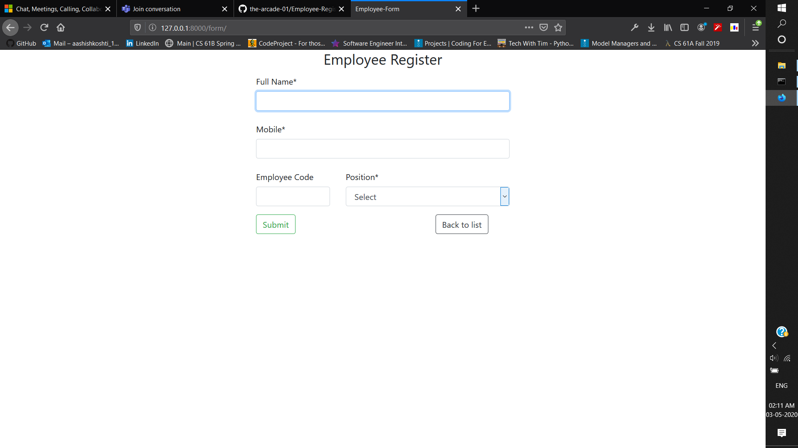
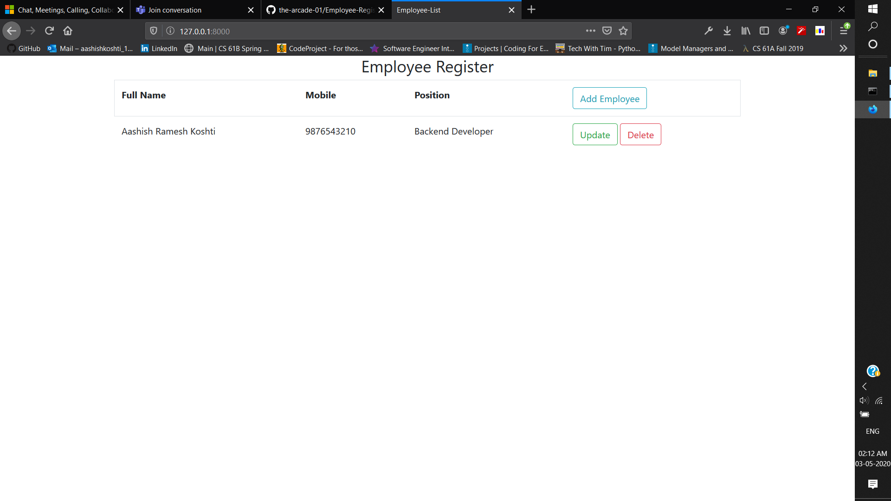

# Employee-Register
Employee Register using Django and PostgreSQL database and having CRUD operations.
- Backend : Django
- Database : Postgresql
- Frontend : HTML, CSS, Bootstrap
## Workflow
 

## Todo
- Host Registeration and User login management
